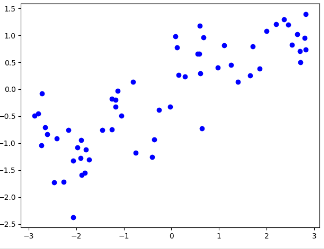
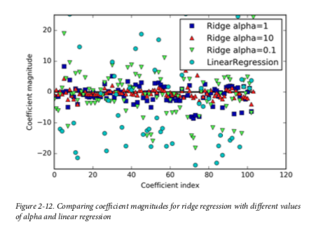
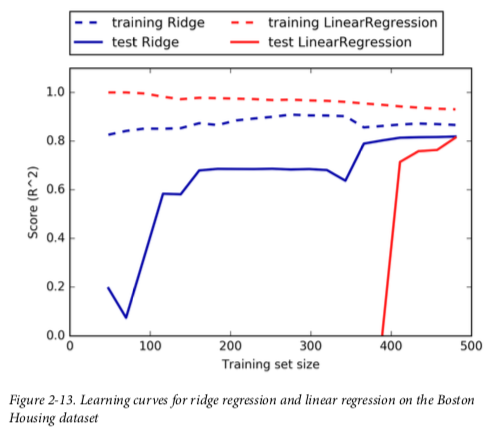
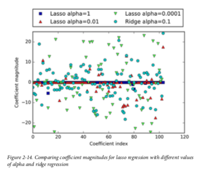

# Chapter2_4: Linear Model

Linear models make a prediction using a linear function of the input features. The general prediction formula for a linear model looks as follows:

```
y = w[0] * x[0] + w[1] * x[1] + ... + w[p] * x[p] + b
```

Here, x[0] to x[p] denotes the features (in this example, the number of features is p) of a single data point, **w and b are parameters** of the model that are learned, and **ŷ is the prediction the model makes**. 

There are many different linear models for regression. The difference between these models lies in how the model parameters w and b are learned from the training data, and how model complexity can be controlled.

### Linear regression (aka ordinary least squares, OSL)

Linear regression finds the parameters w and b that minimize the mean squared error between predictions and the true regression targets, y, on the training set. **The mean squared error** is the sum of the squared differences between the predictions and the true values. Linear regression has no parameters, which is a benefit, but it also has no way to control model complexity.



```python
#!/usr/bin/env python3
# Author Zuxing Gu

from sklearn.linear_model import LinearRegression
from sklearn.model_selection import train_test_split
import mglearn
import matplotlib.pyplot as plt


# linear regression
X, y = mglearn.datasets.make_wave(n_samples = 60)
plt.plot(X, y, 'bo')
plt.show()

X_train, X_test, y_train, y_test = train_test_split(X, y, random_state=42)
lr = LinearRegression().fit(X_train, y_train)
print("lr.coef_: {}".format(lr.coef_))
print("lr.intercept_: {}".format(lr.intercept_))
# lr.coef_: [0.39390555]
# lr.intercept_: -0.031804343026759746
print("Training set score: {:.2f}".format(lr.score(X_train, y_train)))
print("Test set score: {:.2f}".format(lr.score(X_test, y_test)))
# Training set score: 0.67
# Test set score: 0.66 -> underfit
print("x = 0, y_pre is " + lr.predict(0))
# -0.03180434

```


### Ridge regression

Ridge regression is also a linear model for regression, so the formula it uses to make predictions is the same one used for ordinary least squares. In ridge regression, though, the coefficients (w) are chosen not only so that they predict well on the training data, but also to fit an additional constraint. **We also want the magnitude of coefficients to be as small as possible; in other words, all entries of w should be close to zero. Intuitively, this means each feature should have as little effect on the outcome as possible** (which translates to having a small slope), while still predicting well. This constraint is an example of what is called regularization. Regularization means explicitly restricting a model to avoid overfitting.

```python
# ridge regression
from sklearn.linear_model import Ridge
X_train, X_test, y_train, y_test = train_test_split(X, y, random_state=42)
ridge = Ridge(alpha=1.0).fit(X_train, y_train)
print("lr.coef_: {}".format(ridge.coef_))
print("lr.intercept_: {}".format(ridge.intercept_))
# lr.coef_: [0.39390555]
# lr.intercept_: -0.031804343026759746
print("Training set score: {:.2f}".format(ridge.score(X_train, y_train)))
print("Test set score: {:.2f}".format(ridge.score(X_test, y_test)))
# Training set score: 0.67
# Test set score: 0.66 -> underfit
print("x = 0, y_pre is {}".format(ridge.predict(0)))
# -0.03180434
```

The Ridge model makes a trade-off between the simplicity of the model (near-zero coefficients) and its performance on the training set. How much importance the model places on simplicity versus training set performance can be specified by the user, using the **alpha** parameter. Decreasing alpha allows the coefficients to be less restricted, meaning overfitting. For very small values of alpha, coefficients are barely restricted at all, and we end up with a model that resembles LinearRegression. **That is alpha is larger, the coefficient becomes nearer to zero.**





1. As one would expect, the training score is higher than the test score for all dataset sizes, for both ridge and linear regression. **Because ridge is regularized, the training score of ridge is lower than the training score for linear regression across the board.**
2. The test score for ridge is better, particularly for small subsets of the data. For less than 400 data points, linear regression is not able to learn anything. As more and more data becomes available to the model, both models improve, and linear regression catches up with ridge in the end. The lesson here is that **with enough training data, regularization becomes less important, and given enough data, ridge and linear regression will have the same performance.**


### Lasso

An alternative to Ridge for regularizing linear regression is Lasso. As with ridge regression, using the lasso also restricts coefficients to be close to zero, but in a slightly different way, called L1 regularization.8 The consequence of L1 regularization is that when **using the lasso, some coefficients are exactly zero**. This means some features are entirely ignored by the model. This can be seen as a form of automatic feature selection. Having some coefficients be exactly zero often makes a model easier to interpret, and can reveal the most important features of your model.

```python
# Lasso
from sklearn.linear_model import Lasso
lasso = Lasso(alpha=0.01, max_iter=100000).fit(X_train, y_train)
print("lr.coef_: {}".format(lasso.coef_))
print("lr.intercept_: {}".format(lasso.intercept_))
print("Training set score: {:.2f}".format(lasso.score(X_train, y_train)))
print("Test set score: {:.2f}".format(lasso.score(X_test, y_test)))
print("x = 0, y_pre is {}".format(lasso.predict(0)))
'''
lr.coef_: [0.09540593]
lr.intercept_: -0.12222434377983975
Training set score: 0.29
Test set score: 0.24
x = 0, y_pre is [-0.12222434]
'''
```

Similarly to Ridge, the Lasso also has a regularization parameter, alpha, that controls how strongly coefficients are pushed toward zero. In the previous example, we used the default of alpha=1.0. To reduce underfitting, let’s try decreasing alpha. When we do this, we also need to increase the default setting of max_iter (the maximum number of iterations to run). **That is smaller alpha, more features used.**

