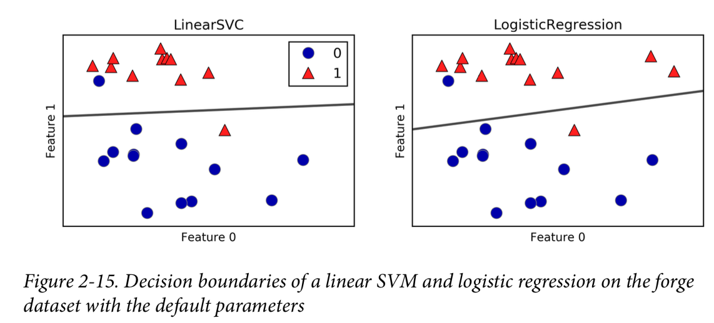
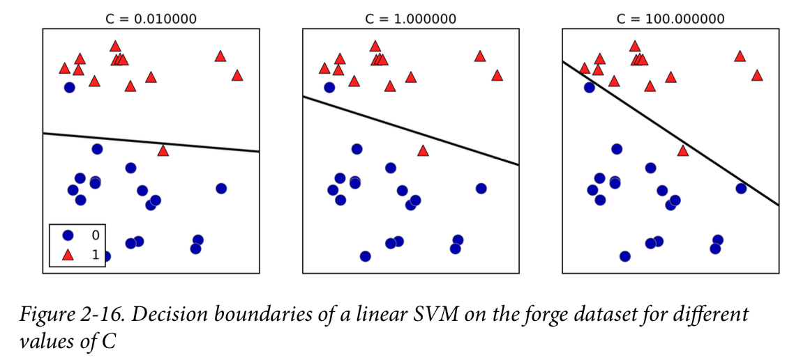
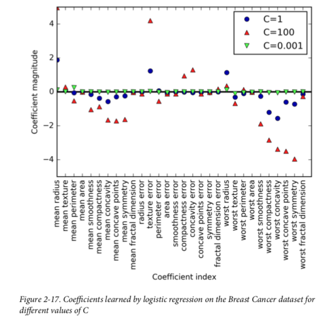
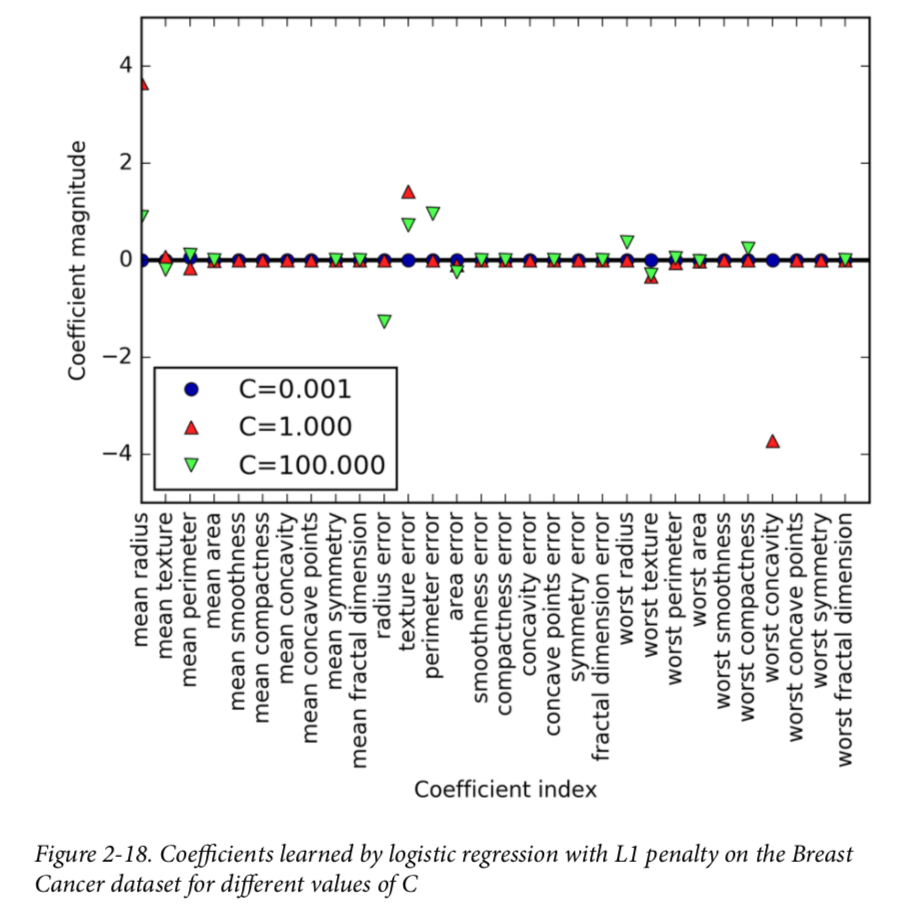
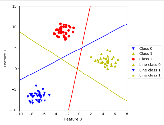

# Chapter2_4: Linear Model for Classification

Let’s look at binary classification first. In this case, a prediction is made using the following formula: 

ŷ = w[0] * x[0] + w[1] * x[1] + ... + w[p] * x[p] + b > 0 

If the function is smaller than zero, we predict the class –1; if it is larger than zero, we predict the class +1. 

For linear models for classification, the decision boundary is a linear function of the input. In other words, a (binary) linear classifier is a classifier that separates two classes using a line, a plane, or a hyper‐plane. 

There are many algorithms for learning linear models. These algorithms all differ in the following two ways: 

- The way in which they measure how well a particular combination of coefficients and intercept fits the training data 
- If and what kind of regularization they use 

The two most common linear classification algorithms are **logistic regression**, implemented in **linear_model.LogisticRegression**, and **linear support vector machines (linear SVMs)**, implemented in **svm.LinearSVC** (SVC stands for support vector classi‐ fier).  By default, both models apply an L2 regularization, in the same way that Ridge does for regression. **When you use a high value for the parameter C, Logis ticRegression and LinearSVC try to fit the training set as best as possible**, while with low values of the parameter C, the models put more emphasis on finding a coefficient vector (w) that is close to zero.

That is larger C, fit the training best, regularize less and the model is more complexed.





Therefore, when more features in the dataset, a larger C many have a better result. Because we have a more complexed models.


**Note**: by default logistic regression use L2 regularization, the C results is listed below. When we use L1 regularization which is based using or igonre features, we can learn that a larger C, we contains more features in our model.

```python
#!/usr/bin/env python3
# Author Zuxing Gu

from sklearn.linear_model import LogisticRegression
from sklearn.svm import LinearSVC
import matplotlib.pyplot as plt
import mglearn
import numpy as np
from sklearn.model_selection import train_test_split

# using the data from sklearn
from sklearn.datasets import load_breast_cancer
cancer = load_breast_cancer()
X_train, X_test, y_train, y_test = train_test_split(
    cancer.data, cancer.target, stratify=cancer.target, random_state=42)

for c in [0.01, 1, 100]:
    logreg = LogisticRegression(C = c).fit(X_train, y_train)
    print("c = {}".format(c))
    print("Training set score: {:.3f}".format(logreg.score(X_train, y_train)))
    print("Test set score: {:.3f}".format(logreg.score(X_test, y_test)))

'''
c = 0.01
Training set score: 0.934
Test set score: 0.930
c = 1
Training set score: 0.953
Test set score: 0.958
c = 100
Training set score: 0.979
Test set score: 0.965
'''

for C, marker in zip([0.001, 1, 100], ['o', '^', 'v']):
    lr_l1 = LogisticRegression(C=C, penalty="l1").fit(X_train, y_train)
    print("Training accuracy of l1 logreg with C={:.3f}: {:.2f}".format(
          C, lr_l1.score(X_train, y_train)))
    print("Test accuracy of l1 logreg with C={:.3f}: {:.2f}".format(
          C, lr_l1.score(X_test, y_test)))
    plt.plot(lr_l1.coef_.T, marker, label="C={:.3f}".format(C))

plt.xticks(range(cancer.data.shape[1]), cancer.feature_names, rotation=90)
xlims = plt.xlim()
plt.hlines(0, xlims[0], xlims[1])
plt.xlim(xlims)
plt.xlabel("Feature")
plt.ylabel("Coefficient magnitude")

plt.ylim(-5, 5)
plt.legend(loc=3)
plt.show()
'''
Training accuracy of l1 logreg with C=0.001: 0.91
Test accuracy of l1 logreg with C=0.001: 0.92
Training accuracy of l1 logreg with C=1.000: 0.96
Test accuracy of l1 logreg with C=1.000: 0.96
Training accuracy of l1 logreg with C=100.000: 0.99
Test accuracy of l1 logreg with C=100.000: 0.98
'''
```







### Linear models for multiclass classification

A common technique to extend a binary classification algorithm to a multiclass classification algorithm is the one-vs.-rest approach. In the one-vs.-rest approach, a binary model is learned for each class that tries to separate that class from all of the other classes, resulting in as many binary models as there are classes.

```python
#!/usr/bin/env python3
# Author Zuxing Gu

from sklearn.datasets import make_blobs
from sklearn.svm import LinearSVC
import matplotlib.pyplot as plt
import numpy as np

X,y = make_blobs(random_state=42)
co = ['ro', 'y^', 'bv']
for a, b, c in zip(X[:,0], X[:,1], y):
    plt.plot(a, b, co[c])


linear_svm = LinearSVC().fit(X, y)
print("Coefficient shape: {}".format(linear_svm.coef_.T))
print("Intercept shape: {}".format(linear_svm.intercept_.T))
'''
Coefficient shape: [[-0.17492497  0.47621415 -0.18914147]
 [ 0.2314118  -0.06937507 -0.20400561]]
Intercept shape: [-1.07745203  0.13140457 -0.08605001]
'''

line = np.linspace(-15, 15)
for coef, intercept, color in zip(linear_svm.coef_, linear_svm.intercept_,
                                  ['b', 'r', 'y']):
    plt.plot(line, -(line * coef[0] + intercept) / coef[1], c=color)
plt.ylim(-10, 15)
plt.xlim(-10, 8)
plt.xlabel("Feature 0")
plt.ylabel("Feature 1")
plt.legend(['Class 0', 'Class 1', 'Class 2', 'Line class 0', 'Line class 1',
                'Line class 2'], loc=(1.01, 0.3))
plt.show()
```



